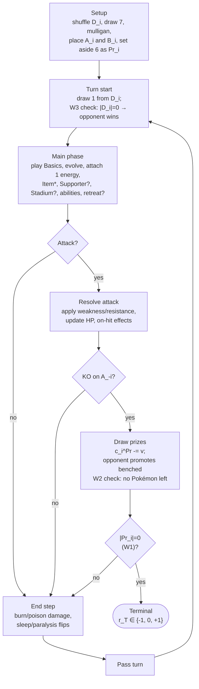
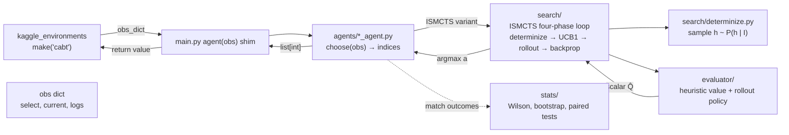

# MDP-Style Formalization of the PTCG Environment

Formal specification of the Pokémon TCG imperfect-information game as
exposed by the Kaggle `cabt` engine. This document is the reference the
`env/`, `agents/`, and `search/` modules must respect; when the code
diverges from the formalization, one of them is wrong.

Prose companion to [`docs/game-primer.md`](game-primer.md); term-level
justifications live in [`exercises/ex01_environment.md`](../exercises/ex01_environment.md).

## Notation

- $N = 2$ players; $i \in \{1, 2\}$ is a player index; $-i$ is the opponent.
- $t \in \mathbb{N}$ is a turn index; $T$ is the (random) terminal turn.
- $|X|$ is a set cardinality; $\Delta(A)$ is the set of probability
  distributions on $A$.
- $\mathbf{1}[\cdot]$ is the indicator function.

## State space $S$

$S$ decomposes as a product of public and private components:

$$
S \;=\; S^{\text{pub}} \times S^{\text{priv}}.
$$

### Public component $S^{\text{pub}}$

For each player $i$:

- $A_i$ — active Pokémon (identity, current HP, energies attached, status
  conditions). Exactly one when player $i$ has any Pokémon in play; else $\bot$.
- $B_i$ — bench, an ordered tuple of up to 5 Pokémon with the same
  per-Pokémon attributes as $A_i$.
- $\text{Disc}_i$ — ordered discard pile (contents are public — any Trainer
  effect can reveal them).
- $c_i^{Pr} \in \{0,\dots,6\}$ — count of prize cards remaining.
- $c_i^D \in \{0,\dots,60\}$ — count of cards remaining in the deck.

Global public state:

- $\text{Stadium} \in \text{StadiumCards} \cup \{\bot\}$.
- $\text{turn} \in \{1, 2\}$ — whose turn it is.
- $t \in \mathbb{N}$ — turn number.
- $\text{log}_t$ — public event log up to turn $t$ (contains every action's
  publicly-visible outcome: attacks, KOs, coin-flip results, revealed cards).

### Private component $S^{\text{priv}}$

- $H_i$ — ordered hand of player $i$. Visible to $i$; only its **size**
  $|H_i|$ is visible to $-i$.
- $D_i$ — ordered deck of player $i$. Multiset is public (deck submissions);
  **order** is private (post-shuffle) to nobody — no player observes it
  until draws happen.
- $Pr_i$ — the specific prize cards of player $i$ (a set of six cards drawn
  face-down at setup). Identity hidden from *both* players until claimed.

### Player observation

The observation function of player $i$ at state $s$:

$$
O_i(s) \;=\; \bigl(\, S^{\text{pub}}(s),\; H_i(s),\; \text{engine option list at }s \,\bigr).
$$

Everything in $O_i(s)$ is what shows up as `obs["current"] ∪ obs["logs"] ∪ obs["select"]`
in the Kaggle dict on our decision turns.

**Explicit unobservables** (for us as player $i$): the multiset and order
of $H_{-i}$, the order of $D_i$ and $D_{-i}$, and the identities of $Pr_1$
and $Pr_2$ until each specific prize is drawn.

## Information sets $I_i(s)$

The information set of state $s$ for player $i$ is the equivalence class

$$
I_i(s) \;=\; \bigl\{\, s' \in S \;:\; O_i(s') = O_i(s)\,\bigr\}.
$$

Two states are in the same information set iff player $i$ cannot
distinguish them from observations alone. Every admissible policy for
player $i$ is $I_i$-measurable — see [`exercises/ex01_environment.md`
§2](../exercises/ex01_environment.md).

**Size regime.** For a mid-game state where the opponent has 4 cards in
hand from 42 unseen cards, $|I_i(s)|$ is $\gtrsim 10^{50}$
([ex01 §3](../exercises/ex01_environment.md)). Explicit enumeration is
never feasible; we sample $h \sim P(h \mid I_i)$ (determinization) at
search time.

## Action space $A(s)$

The `cabt` engine only surfaces legal actions; the agent never filters
for legality. Formally, at any decision state $s$ where it is our turn to
act,

$$
A(s) \;=\; \bigl\{\, \mathbf{a} \subseteq \{0,\dots,|\text{option}|-1\} \;:\; c_{\min}\le|\mathbf{a}|\le c_{\max},\; \mathbf{a}\text{ has no duplicates}\,\bigr\},
$$

where $\text{option}$, $c_{\min}$, $c_{\max}$ are `obs["select"]["option"]`,
`obs["select"]["minCount"]`, and `obs["select"]["maxCount"]` respectively.
The agent returns an $\mathbf{a} \in A(s)$ as an ordered list of indices.

An action of size $c_{\min} = c_{\max} = 1$ is the common case (single
option pick). Multi-element selections (e.g. discarding several cards) use
$c_{\min}, c_{\max} > 1$.

Deck submission is a distinguished "action" on the initial call: when
`obs["select"] is None`, the agent returns a 60-tuple of card IDs
(see [`docs/engineering.md`](engineering.md)).

## Transition kernel $P$

Given state $s$, action $\mathbf{a}$, the next state $s'$ is sampled from
the engine's transition kernel

$$
s' \sim P(\cdot \mid s, \mathbf{a}).
$$

The randomness comes from:

- **Draw effects.** Any "draw $k$" or "search deck" resolution draws
  from $D_i$ (a hypergeometric-like conditional on the multiset).
- **Coin flips.** $\text{Bernoulli}(1/2)$ per flip declared by card
  text; independent conditional on prior flips.
- **Random discards / shuffles.** Uniform over the induced permutation
  group of the affected pile.

We do not have a closed-form $P$; the simulator is authoritative. What we
*do* have is a well-defined conditional $P(h \mid I_i)$ for
determinization: given the public state and our own hand, all consistent
hidden configurations are equally likely (uniform over the induced
permutation group), because none of the hidden information has been
correlated with any observation.

## Reward $R$

Terminal only, per [`docs/adr/adr-004-terminal-reward-not-shaped.md`](adr/adr-004-terminal-reward-not-shaped.md):

$$
r_t \;=\;
\begin{cases}
+1 & t = T,\ \text{player $i$ wins},\\
-1 & t = T,\ \text{player $i$ loses},\\
\ \,0 & t = T,\ \text{draw},\\
\ \,0 & t < T.
\end{cases}
$$

The return $G_t \;=\; \sum_{k \ge t} r_k \;=\; r_T$ — no discount, no
shaping. UCB1 backup statistics at internal search nodes are means of
$r_T$ realizations.

## Terminal condition

Match ends when any of the win conditions from
[`docs/rules-summary.md`](rules-summary.md) is satisfied, or when the
10-minute wall-clock budget expires (in which case the engine declares
a result per its own tie-break; we treat this as $r_T = 0$ unless it
declares otherwise).

## Policy class

Our policy $\pi$ is a function

$$
\pi:\ I_i \to \Delta\bigl(A(s)\bigr),
$$

$I_i$-measurable by construction. ISMCTS approximates the argmax over
this class by

$$
a^* = \arg\max_a \;\mathbb{E}_{h \sim P(h \mid I_i)}\bigl[\, Q(I_i, a, h) \,\bigr],
$$

where $Q(I_i, a, h)$ is the search's estimated action-value on the
determinized world $h$.

## Diagram 1 — Logical flow of a match

## Diagram 2 — Software pipeline (Phase 3 onward)

Random and heuristic agents skip the `search/` and `evaluator/` boxes —
they map `obs → indices` directly. The pipeline shape is fixed from
Phase 3 onward; earlier phases fill in a strict subset.

## Correspondence to `env/`

- [`env/observation.py`](../env/observation.py) — the (currently trivial)
  wrapper over `obs["select"]`, `obs["current"]`, `obs["logs"]`. The dict
  interface is the source of truth (no `cg.api` in the current SDK).
- [`env/actions.py`](../env/actions.py) — helpers over
  `obs["select"]["option"]`, `minCount`, `maxCount`.
- [`env/wrapper.py`](../env/wrapper.py) — `deck.csv` reader used by the
  shim on the initial-call branch.

Any change to these files that breaks the correspondence with the
formalization above should update this document in the same commit.
